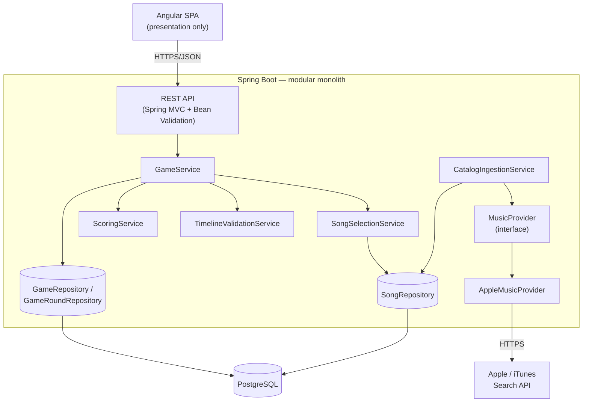
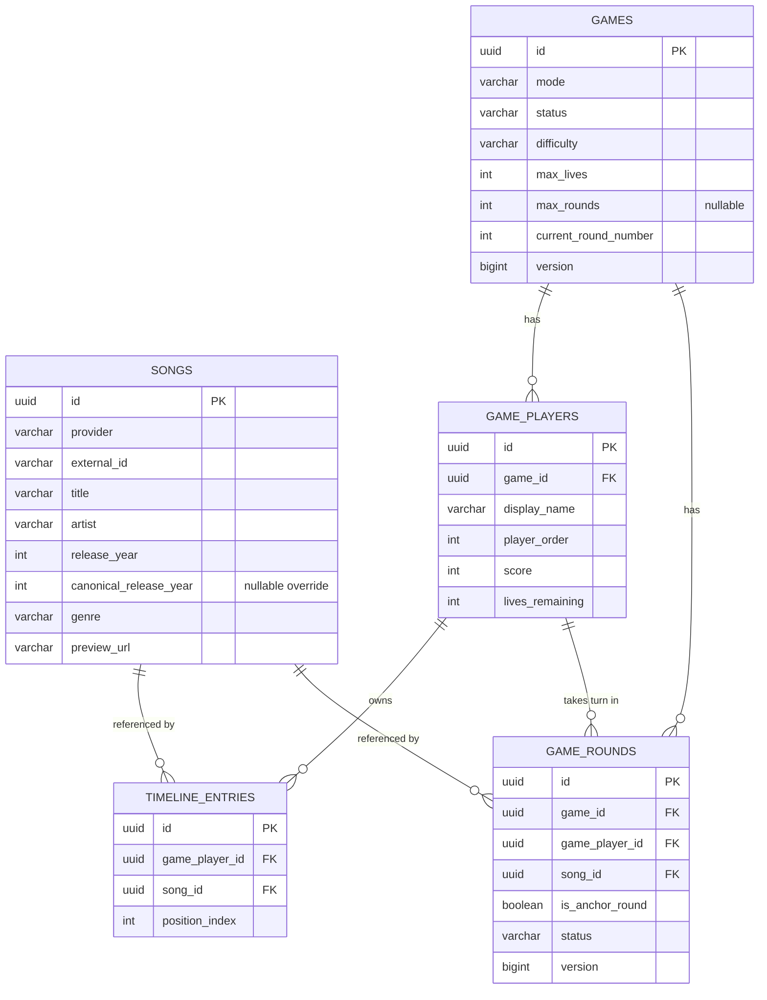

# Chronobeat

**A chronological music game: hear a mystery song, guess where it belongs on your timeline before the title, artist or year are revealed.**

This is an original portfolio project inspired by the general concept of physical music-chronology party games. It does not use any third-party brand's name, artwork, card design or database — it's built from scratch on top of Apple's public iTunes Search API for song metadata and 30-second previews.

| | | |
|---|---|---|
|  |  |  |

<sub>Screenshots are from an actual running instance of this repo, seeded with real Apple Music catalog data.</sub>

## Why this exists

Physical chronology card games have a fixed deck: play enough times and you've memorized it. Chronobeat solves that by drawing from a growing, filterable catalog (genre, region, decade, difficulty) instead of a box of 300 cards — solo or pass-the-device local multiplayer, replayable indefinitely.

## How a round works

1. A short (≈12s) preview plays. Title, artist and year are **not** sent to the browser at this point — not just hidden with CSS, actually withheld by the API (see [Preventing answer leakage](#preventing-answer-leakage)).
2. You place it on your timeline: before your earliest song, between two songs, or after your latest one.
3. The backend validates the position against the *real* release year and reveals the song.
4. Correct → it joins your timeline, and the next round gets a little harder. Incorrect → you lose a life, and it's discarded.
5. Repeat until you run out of lives (or hit an optional round cap).

The very first round of a fresh timeline is a special **anchor round**: there's nothing to compare it against yet, so it's just revealed and placed automatically — no guess, no score impact.

## Features

- **Solo mode**: build the longest timeline you can before your lives run out.
- **Local multiplayer**: 2–8 players pass one device; each builds their own timeline from the same round-robin game.
- **Configurable pool**: region, genre, decade/custom year range, and a difficulty setting that biases song selection toward wider (easy) or tighter (hard) chronological gaps around your existing timeline — see [Difficulty](#difficulty-a-defensible-alternative-to-fake-popularity).
- **Scoring**: base points + a streak bonus, tracked accuracy, best streak, timeline length.
- **~3,000-song catalog** ingested from real Apple Music metadata out of the box (see [Development data](#development-data--catalog-ingestion)), spanning the 1950s–2020s across a dozen genres.
- **OpenAPI docs** at `/swagger-ui.html` whenever the backend is running.

## Architecture



The **domain never talks to Apple directly** — `GameService` and `SongSelectionService` only see `Song` rows in our own database. `CatalogIngestionService` is the one place that pulls from a `MusicProvider`, normalizes the result, and writes `Song` entities. Swapping in a second provider (Audius, a licensed catalog, a user's own playlist) means writing one more `MusicProvider` implementation — nothing in the game logic changes. See `backend/src/main/java/com/chronobeat/integration/music/`.

### Backend package layout

```
com.chronobeat
├── config          Typed @ConfigurationProperties, CORS, OpenAPI, RestClient, catalog bootstrap
├── controller       Thin — validation + delegation only
├── dto               Request/response records, deliberately separate from entities
├── domain            Entities + enums (Game, GamePlayer, GameRound, TimelineEntry, Song, ...)
├── repository        Spring Data JPA + JPA Specifications for song filtering
├── service           GameService (orchestration), SongSelectionService, TimelineValidationService,
│                     ScoringService, CatalogIngestionService, GenreNormalizer
├── mapper            Entity → DTO conversion, kept out of controllers and services
├── integration.music MusicProvider abstraction + the Apple/iTunes implementation
├── exception         Domain exceptions + a single @RestControllerAdvice
└── util              RandomProvider (an injectable seam so selection is unit-testable)
```

### Request lifecycle, end to end

`Angular GameService` → `HttpClient` → Spring's `DispatcherServlet` → `GameController` (validates the request body via Bean Validation, then delegates immediately) → `GameService` (the only class allowed to mutate `Game`/`GamePlayer`/`GameRound`; every individual rule — song selection, placement validation, scoring — is delegated to a focused, independently-tested collaborator) → `GameRepository`/`GameRoundRepository` (Spring Data JPA, Hibernate, Flyway-managed schema) → `GameMapper` converts the resulting entity graph to a response DTO → back to Angular, which only ever renders what the DTO gives it.

### Preventing answer leakage

This is enforced at the **API contract level**, not the UI:

- `GET /rounds/current` returns `RoundPendingResponse` — preview URL, the player's *own already-revealed* timeline, allowed position count. There is no field for title/artist/year/album/genre of the mystery song; the DTO class doesn't have one to accidentally serialize.
- Only `POST /rounds/{id}/answer` — after the round is resolved server-side — returns `RoundResultResponse`, which includes the `SongRevealResponse`.
- The backend independently validates `insertPosition`; it never trusts (or even accepts) a claimed "correct year" from the client.

### Timeline validation (the most important domain rule)

An insertion index `i` (0 = before the earliest song, N = after the latest) is correct when the entry immediately before it has a year ≤ the mystery year **and** the entry immediately after it has a year ≥ the mystery year. When the mystery year ties an existing entry's year, *both* the index before and after that entry are valid — a tie is never unfairly marked wrong. See `TimelineValidationService` and its exhaustive test suite (`TimelineValidationServiceTest`) for every boundary case: empty timeline, single entry, duplicate years, multi-way ties.

### Difficulty: a defensible alternative to fake popularity

The brief explicitly rules out fabricating a "popularity" score the iTunes API can't actually back up. Instead, `SongSelectionService` re-ranks the (already filtered) candidate pool by how far each candidate's year is from the player's *existing* timeline entries: **Easy** keeps the widest gaps (unambiguous placement), **Hard** keeps the narrowest (genuinely close calls), **Normal** leaves the pool unweighted. This is a chronological-spacing heuristic, not a claim about which songs are more "famous."

### Concurrency & idempotency

- `GameRound` and `Game` carry a `@Version` column (optimistic locking). A duplicate answer submission that races past the initial status check still gets caught at commit time and mapped to `409 Conflict`.
- Inserting a new timeline entry shifts existing positions in the same transaction Hibernate flushes inserts before updates, so the DB's `(player, position)` uniqueness constraint is `DEFERRABLE INITIALLY DEFERRED` — checked at commit, not per-statement. (This was caught by the Testcontainers integration test, not guessed up front — see `V1__init_schema.sql`.)

## Database model



`Song` rows are a durable, shared catalog — never deleted when a game ends. Solo and local-multiplayer are the *same* model: solo is simply a one-player `Game`. Every player has their own `TimelineEntry` list; `GameRound` records whose turn it is and which song they were played.

## Music provider integration & catalog quality

- Uses Apple's public, unauthenticated iTunes Search API — metadata + preview URL only. **No audio is downloaded or rehosted**; the game streams the preview URL Apple returns directly.
- **Release-year correction**: the API sometimes returns a remaster/reissue instead of the original pressing. `CatalogIngestionService` normalizes titles (stripping suffixes like "- Remastered 2011", "(Live)", "(Deluxe Edition)") to detect duplicates of a song already in the catalog, and keeps the *earliest* known year as a `canonicalReleaseYear` override rather than duplicating the row.
- **Quality filtering**: titles containing "karaoke", "tribute to", "made famous by", etc. are rejected outright, and any track missing a preview URL or a parseable release date is dropped before it ever reaches the database.
- **Resilience**: iTunes eventually 403s under a sustained burst (confirmed empirically during a real ~3,000-song seed run) — every provider call is caught, logged, and degrades to an empty result rather than failing the whole ingestion run; the courtesy rate-limit (`chronobeat.music.apple.min-request-interval-millis`) reduces how often that happens.

### Development data / catalog ingestion

The app is **not playable against an empty database**. `CatalogBootstrapRunner` checks the catalog size on startup (skipped under the `prod`/`test` profiles) and, if it's below a threshold, kicks off a background ingestion pass over ~110 curated artist/genre search terms spanning the 1950s–2020s (`SeedCatalogQueries`). On a fresh `docker compose up`, expect the catalog to fill in over the following 1–2 minutes; `GET /api/admin/catalog/size` reports progress.

To (re-)ingest manually (e.g. in production, deliberately):

```bash
curl -X POST "https://your-backend/api/admin/catalog/ingest/seed?market=US" \
  -H "X-Admin-Key: $ADMIN_INGEST_KEY"
```

## API

Full interactive docs live at `/swagger-ui.html` (OpenAPI JSON at `/v3/api-docs`) whenever the backend is running. Summary:

| Method | Path | Purpose |
|---|---|---|
| `POST` | `/api/games` | Create a game (`CREATED`) |
| `POST` | `/api/games/{id}/start` | `CREATED` → `ACTIVE`, deals round 1 |
| `GET` | `/api/games/{id}` | Game + player state |
| `GET` | `/api/games/{id}/rounds/current` | The pending round (safe to re-fetch after a refresh) |
| `POST` | `/api/games/{id}/rounds/{roundId}/answer` | Resolve a round, reveal the song |
| `POST` | `/api/games/{id}/next-round` | Advance turn order, deal the next round |
| `GET` | `/api/games/{id}/timeline?playerId=` | A player's confirmed timeline |
| `GET` | `/api/games/{id}/results` | Final standings (once `FINISHED`) |
| `GET` | `/api/admin/catalog/size` | Current catalog size |
| `POST` | `/api/admin/catalog/ingest/seed` | Re-run seed ingestion (requires `X-Admin-Key`) |

## Technology stack

**Backend** — Java 21, Spring Boot, Spring Web MVC, Spring Data JPA, Bean Validation, PostgreSQL, Flyway, Maven, springdoc-openapi, JUnit 5, Mockito, AssertJ, Testcontainers.
**Frontend** — Angular (standalone components, signals, the new `@if`/`@for` control flow), TypeScript, SCSS, Angular Router, `HttpClient`, Vitest.
**Infra** — Docker (multi-stage, non-root), Docker Compose, GitHub Actions, deployed to Cloudflare Pages (frontend) + Render (backend) + Neon (Postgres).

*A note on the versions:* this project pins the current stable major releases at the time it was built (Spring Boot 4 / Spring Framework 7, Angular 21) rather than an older LTS line, on the theory that a portfolio project should reflect the ecosystem a new hire will actually land in.

## Running locally

### Option A — plain (fastest inner loop)

Requires a local PostgreSQL 16 (or use `docker compose up -d db`), Java 21, Node 22.

```bash
# 1. Database
docker compose up -d db     # or point DATABASE_URL at your own Postgres

# 2. Backend (http://localhost:8080) - Flyway migrates on startup,
#    catalog auto-seeds in the background on first run
cd backend
./mvnw spring-boot:run

# 3. Frontend (http://localhost:4200)
cd frontend
npm install
npm start
```

### Option B — Docker Compose (closest to production topology)

```bash
docker compose up -d --build
# frontend: http://localhost:4200
# backend:  http://localhost:8080  (swagger at /swagger-ui.html)
```

If those default ports collide with something else already running on your machine, create a git-ignored `docker-compose.override.yml` remapping just the `ports:`/`environment:` you need — Compose merges it automatically. (`ports` merges by concatenation across files by default; use the `!override` YAML tag on that key if you need a clean replacement instead of an addition.)

### Environment variables

See [`.env.example`](.env.example) for the full list with defaults. Nothing needs to be set to run locally — `application.yml`'s fallbacks target `localhost`. The two that matter for a non-default setup: `DATABASE_URL` (Neon's **JDBC**-formatted connection string, not the `postgres://` one) and `FRONTEND_URL` (exact CORS origin, no wildcard).

## Testing

```bash
cd backend && ./mvnw test     # unit tests + a Testcontainers Postgres integration test
cd frontend && npm test       # Vitest
```

Backend coverage focuses on domain-critical logic per the brief's priority order: `TimelineValidationServiceTest` is exhaustive (empty/single/duplicate-year/tie boundaries), plus `ScoringServiceTest`, `GamePlayerTest`/`GameTest` (elimination & finish-condition rules), `SongSelectionServiceTest` (artist-avoidance and difficulty-spacing behavior via a fake `RandomProvider`, no flaky real randomness), and `CatalogIngestionServiceTest` (title-normalization dedup logic, including the deliberately tricky case of a title that legitimately *starts* with a parenthetical). `GameServiceIntegrationTest` runs the full create → start → anchor round → correct/incorrect placement → elimination → results flow against a real, ephemeral Postgres container — this is what caught the deferred-constraint bug mentioned above.

Frontend tests target the logic that isn't purely template rendering: `GameSetup`'s submit-eligibility rules, `AudioPlayer`'s playback-cap-at-N-seconds behavior, `Timeline`'s slot generation and click-to-select wiring.

## Docker

Both `backend/Dockerfile` and `frontend/Dockerfile` are multi-stage and run as a non-root user (backend) / standard `nginx:alpine` (frontend). The frontend image is **environment-agnostic**: `docker-entrypoint.sh` regenerates `env.js` from the `API_BASE_URL` container env var at *startup*, not at build time, so the same built image can be deployed against different backends without rebuilding.

## Deployment

| Layer | Target | Notes |
|---|---|---|
| Frontend | Cloudflare Pages | Build command `npm run build`, output dir `dist/frontend/browser`. Set `API_BASE_URL` (via a Pages build-time env var feeding a small pre-build step, since static hosting has no server-side entrypoint) to your Render backend's public URL. |
| Backend | Render | Deploy `backend/Dockerfile` as a Docker web service. Set `DATABASE_URL`/`DATABASE_USERNAME`/`DATABASE_PASSWORD` (Neon), `FRONTEND_URL` (your Cloudflare Pages URL, no wildcard), `ADMIN_INGEST_KEY`, `SPRING_PROFILES_ACTIVE=prod`. Render sets `PORT` automatically; `application.yml` already reads it. |
| Database | Neon PostgreSQL | Use the **JDBC** connection string form with `?sslmode=require`. Flyway migrates automatically on backend startup — no manual step. |

`CatalogBootstrapRunner` is disabled under the `prod` profile on purpose: catalog growth in production should be a deliberate, observed `POST /api/admin/catalog/ingest/seed` call, not an unattended startup side effect.

## Known limitations

- **iTunes rate limiting**: sustained bursts (e.g. re-running the full seed ingestion) eventually get 403'd by Apple's edge; the app degrades gracefully (skips that query, keeps going) rather than crashing, but a production system pulling from this provider at scale would want real exponential backoff/retry, not just a fixed courtesy delay.
- **No drag-and-drop**: placement is click/tap-to-select (explicitly allowed by the brief for mobile reliability). Drag-and-drop is a reasonable follow-up for desktop.
- **Guest play only**: no persistent accounts, so no cross-session statistics dashboard yet (see roadmap). Game state lives entirely in Postgres keyed by a random `gameId`, not tied to any user.
- **Difficulty is a spacing heuristic**, not a popularity model — see [above](#difficulty-a-defensible-alternative-to-fake-popularity) for why that's a deliberate choice, not an oversight.

## Roadmap

Everything below is architected for (the `MusicProvider` interface, the N-player `Game` model, the `GameMode` enum) but intentionally not built in this pass, so the core solo/local-multiplayer experience could be finished to a high standard first:

- Persistent accounts + a statistics dashboard (accuracy by decade/genre, this is the natural next step once game history needs to outlive a browser tab)
- Playlist import (`PlaylistImporter` abstraction, same pattern as `MusicProvider`)
- Online multiplayer via Spring WebSocket/STOMP + room codes
- A second `MusicProvider` implementation, to prove the abstraction actually decouples cleanly
- PWA support, daily challenge, shareable results

## Legal / provider note

This project uses Apple's public iTunes Search API for a personal, non-commercial portfolio prototype. It does not download, rehost, or claim ownership of any audio or artwork — previews stream directly from Apple's CDN, and all metadata is attributed to its original artists. Provider terms and music licensing would need a proper review before any commercial or large-scale use.

## Author

Built by Andrés Carretero as a backend-focused portfolio project (Java/Spring Boot) with a complete, deployable Angular frontend around it.
