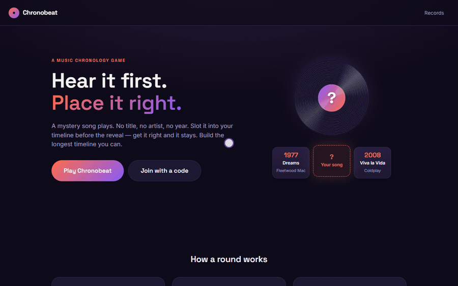
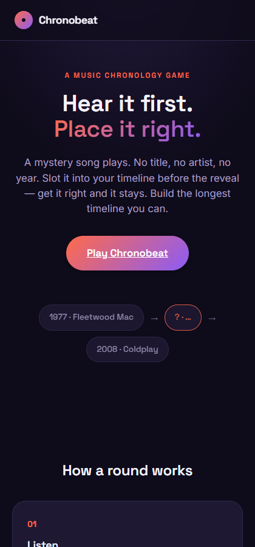
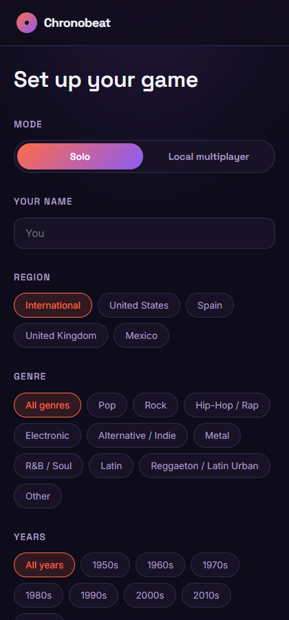
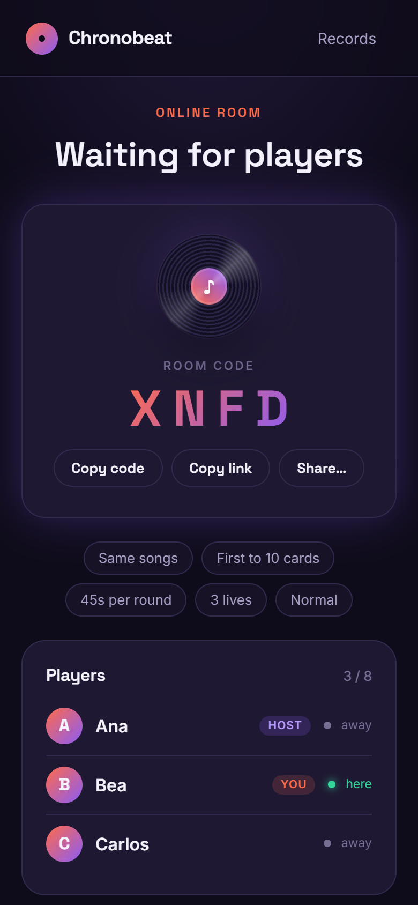
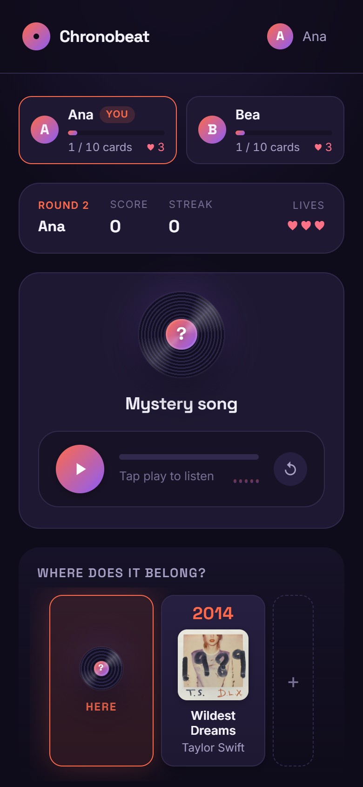
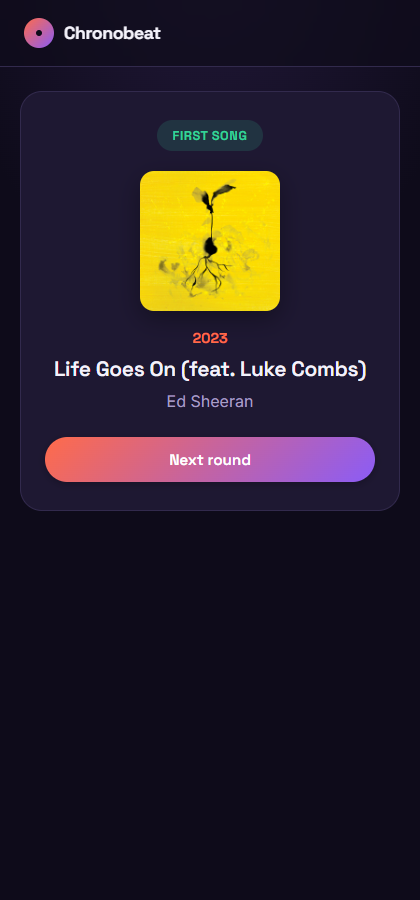
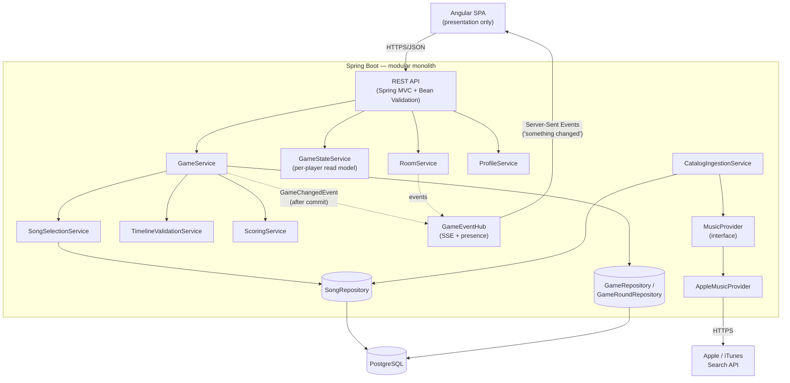
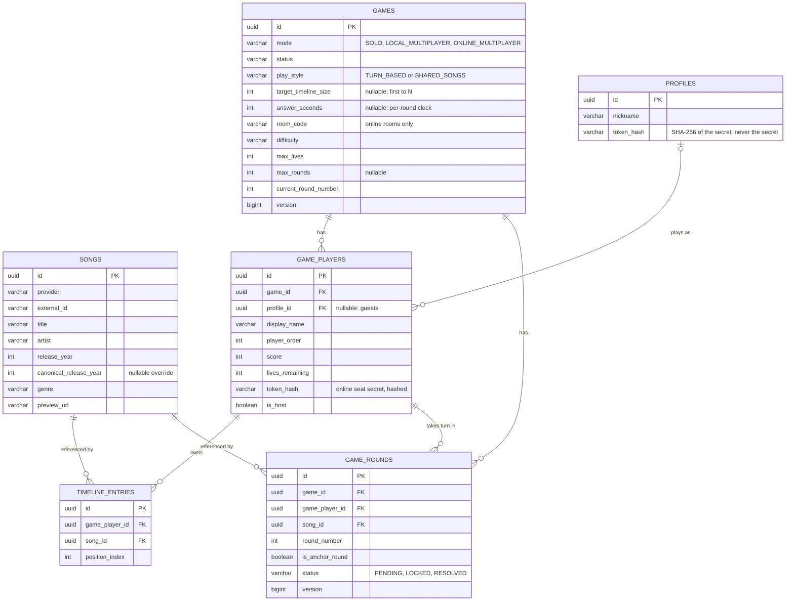

# Chronobeat 🎵

**A chronological music game: hear a mystery song, guess where it belongs on your timeline before the title, artist or year are revealed.**

Solo, around one shared phone, or online from separate devices with a room code — drawing from a
catalog of thousands of real songs instead of a fixed deck you end up memorising.

**[Try it live → chronobeat.pages.dev](https://chronobeat.pages.dev)**

<sub>The backend runs on Render's free tier: after ~15 minutes without traffic it sleeps, and the
first request takes 30–50 s to wake it up. After that it's fast.</sub>




*Home → setting up a solo game → a preview plays and you place it on your timeline → the reveal
(right or wrong) → opening an online room that friends join with a 4-letter code.*

This is an original portfolio project inspired by the general concept of physical music-chronology party games. It does not use any third-party brand's name, artwork, card design or database — it's built from scratch on top of Apple's public iTunes Search API for song metadata and 30-second previews.

<details>
<summary>More screenshots</summary>

| | | |
|---|---|---|
|  |  |  |
|  |  | |

<sub>The home screen, a shared-device game being set up, an online room's lobby, placing a card, and the reveal with two players.</sub>

</details>

## Why this exists

Physical chronology card games have a fixed deck: play enough times and you've memorized it. Chronobeat solves that by drawing from a growing, filterable catalog (genre, region, decade, difficulty) instead of a box of 300 cards — solo, around one shared phone, or online from separate devices, replayable indefinitely.

## How a round works

1. A short (≈12s) preview plays. Title, artist and year are **not** sent to the browser at this point — not just hidden with CSS, actually withheld by the API (see [Preventing answer leakage](#preventing-answer-leakage)).
2. You place it on your timeline: before your earliest song, between two songs, or after your latest one.
3. The backend validates the position against the *real* release year and reveals the song.
4. Correct → it joins your timeline, and the next round gets a little harder. Incorrect → you lose a life, and it's discarded.
5. Repeat until you run out of lives, hit an optional round cap, or reach the goal (see below).

The very first round of a fresh timeline is a special **anchor round**: there's nothing to compare it against yet, so it's just revealed and placed automatically — no guess, no score impact.

### Two ways to deal, three ways to sit

With more than one player, the table picks how songs are dealt:

- **Take turns** — every turn is one player's own song, placed on their own timeline. The classic party rhythm.
- **Same songs** — every player hears the *same* song each round and places it on their own timeline. Because nobody gets an easier card, it is a fair race; the natural goal is **first to N cards** (10 by default).

…and where they sit:

- **Solo** — one player; an optional goal ("reach 15 cards") replaces the lives-based ending.
- **Same device** — 2–8 players pass one phone. A hand-over screen hides each player's timeline from the others.
- **Online** — a host opens a room, friends join from their own phones with a 4-letter code or a shared link, and everyone plays live.

In *Same songs*, your placement is only **locked in** and nothing is judged until every player has answered (or the clock runs out), so no result can leak to someone still thinking. The whole table then sees the reveal together.

## Features

- **Solo, same-device and online play**, each with either play style, an optional first-to-N goal, and a per-round clock (always on for online rooms, so a closed tab can't stall the table).
- **Online rooms**: short consonant-only codes (they can't spell words), shareable links, a live lobby with a connected indicator, host-only start and remove, per-player secret tokens, and rejoining the same seat after a refresh.
- **Anonymous profiles and a record book**: no sign-up; your browser holds a secret token and the server keeps only its hash. Longest timeline, best score and streak, accuracy by decade and genre, recent games, and "new record!" callouts on the results screen. A recovery code moves your profile to another device.
- **Configurable pool**: region, genre, decade/custom year range, and a difficulty setting that biases song selection toward wider (easy) or tighter (hard) chronological gaps around your existing timeline — see [Difficulty](#difficulty-a-defensible-alternative-to-fake-popularity).
- **Scoring**: base points + a streak bonus, tracked accuracy, best streak, timeline length.
- **~3,000-song catalog** ingested from real Apple Music metadata out of the box (see [Development data](#development-data--catalog-ingestion)), spanning the 1950s–2020s across a dozen genres.
- **OpenAPI docs** at `/swagger-ui.html` whenever the backend is running.

## Architecture



The **domain never talks to Apple directly** — `GameService` and `SongSelectionService` only see `Song` rows in our own database. `CatalogIngestionService` is the one place that pulls from a `MusicProvider`, normalizes the result, and writes `Song` entities. Swapping in a second provider (Audius, a licensed catalog, a user's own playlist) means writing one more `MusicProvider` implementation — nothing in the game logic changes. See `backend/src/main/java/com/chronobeat/integration/music/`.

### Backend package layout

```
com.chronobeat
├── config          Typed @ConfigurationProperties, CORS, OpenAPI, RestClient, catalog bootstrap
├── controller       Thin — validation + delegation only
├── dto               Request/response records, deliberately separate from entities
├── domain            Entities + enums (Game, GamePlayer, GameRound, TimelineEntry, Song, ...)
├── repository        Spring Data JPA + JPA Specifications for song filtering
├── service           GameService (orchestration), GameStateService (per-player read model),
│                     RoomService, ProfileService/ProfileStatsService, PlayerAuthenticator,
│                     SongSelectionService, TimelineValidationService, ScoringService,
│                     CatalogIngestionService, GenreNormalizer, GameMaintenanceScheduler
├── event             GameEvents → GameChangedEvent → GameEventHub (SSE) + PresenceRegistry
├── mapper            Entity → DTO conversion, kept out of controllers and services
├── integration.music MusicProvider abstraction + the Apple/iTunes implementation
├── exception         Domain exceptions + a single @RestControllerAdvice
└── util              RandomProvider (an injectable seam so selection is unit-testable)
```

### Request lifecycle, end to end

`Angular GameService` → `HttpClient` → Spring's `DispatcherServlet` → `GameController` (validates the request body via Bean Validation, then delegates immediately) → `GameService` (the only class allowed to mutate `Game`/`GamePlayer`/`GameRound`; every individual rule — song selection, placement validation, scoring — is delegated to a focused, independently-tested collaborator) → `GameRepository`/`GameRoundRepository` (Spring Data JPA, Hibernate, Flyway-managed schema) → `GameMapper` converts the resulting entity graph to a response DTO → back to Angular, which only ever renders what the DTO gives it.

### Preventing answer leakage

This is enforced at the **API contract level**, not the UI:

- While a player is answering, `GET /state` carries a `RoundPendingResponse` — preview URL, the player's *own already-revealed* timeline, allowed position count. There is no field for title/artist/year/album/genre of the mystery song; the DTO class doesn't have one to accidentally serialize.
- The song's identity appears only in a `RoundSummaryResponse`, which is built exclusively from rounds that are already **resolved**.
- In a *Same songs* round, `POST /answer` merely **locks** the placement (`resolved: false`). Correctness, score and lives are not computed — they don't even exist in the database — until the last player has answered or the clock ran out, so nothing can leak to someone still thinking. The tests assert this directly, and an HTTP-level test checks that the JSON a player receives never contains the mystery title.
- The backend independently validates `insertPosition`; it never trusts (or even accepts) a claimed "correct year" from the client.

### Timeline validation (the most important domain rule)

An insertion index `i` (0 = before the earliest song, N = after the latest) is correct when the entry immediately before it has a year ≤ the mystery year **and** the entry immediately after it has a year ≥ the mystery year. When the mystery year ties an existing entry's year, *both* the index before and after that entry are valid — a tie is never unfairly marked wrong. See `TimelineValidationService` and its exhaustive test suite (`TimelineValidationServiceTest`) for every boundary case: empty timeline, single entry, duplicate years, multi-way ties.

### Difficulty: a defensible alternative to fake popularity

The brief explicitly rules out fabricating a "popularity" score the iTunes API can't actually back up. Instead, `SongSelectionService` re-ranks the (already filtered) candidate pool by how far each candidate's year is from the player's *existing* timeline entries: **Easy** keeps the widest gaps (unambiguous placement), **Hard** keeps the narrowest (genuinely close calls), **Normal** leaves the pool unweighted. This is a chronological-spacing heuristic, not a claim about which songs are more "famous."

### One read model for every screen

`GET /api/games/{id}/state` returns one player's complete view — the **phase** they are in (`LOBBY`, `ANSWERING`, `WAITING`, `REVEAL`, `FINISHED`) and exactly what that phase may show. Solo, shared-device and online games, in either play style, all render from it, so there is a single state machine on the client instead of a set of special cases. A refresh, a sleeping phone or a missed event can never leave a screen out of step, because the client never patches local state: it just asks again.

### Live updates: notify, then re-fetch

Online tables are told about changes over **Server-Sent Events** (`GET /api/games/{id}/events`). The events carry no game data, only "something changed"; on each one the client re-fetches its state. That makes a lossy or reordered stream harmless, needs no bidirectional protocol (actions are ordinary REST calls, the browser's `EventSource` reconnects by itself), and keeps events tiny. They are published *after the transaction commits*, so a client woken by one always finds the new state. A heartbeat keeps proxies from closing idle streams, and a slow client-side poll backs the stream up.

The hub is in memory, which is right for one backend instance (a single Render service). Scaling out would put a shared broker (Redis pub/sub, Postgres `LISTEN/NOTIFY`) behind `GameEventHub`.

### Concurrency & idempotency

- Every state-changing call first takes a **row lock on the game** (`SELECT … FOR UPDATE`). Two players locking in at the same instant are therefore handled one after the other; without it, each transaction could see the other as "not answered yet" and the round would never resolve.
- "Everybody taps Next" is safe: the client sends the round it just watched (`?after=N`), and if the game already moved past it the call is a no-op instead of skipping a round. Online reveals can't be skipped in their first 3 seconds, and move on by themselves after 12.
- Online players who stop answering are timed out by a background sweep and count as a miss; abandoned rooms are closed after a while so their codes can be reused.
- `GameRound` and `Game` carry a `@Version` column (optimistic locking) as a second line of defence. A duplicate answer submission that races past the initial status check still gets caught at commit time and mapped to `409 Conflict`.
- Inserting a new timeline entry shifts existing positions in the same transaction Hibernate flushes inserts before updates, so the DB's `(player, position)` uniqueness constraint is `DEFERRABLE INITIALLY DEFERRED` — checked at commit, not per-statement. (This was caught by the Testcontainers integration test, not guessed up front — see `V1__init_schema.sql`.)

## Database model



`Song` rows are a durable, shared catalog — never deleted when a game ends. Solo, shared-device and online play are the *same* model: solo is simply a one-player `Game`. Every player has their own `TimelineEntry` list. A `GameRound` is one player's turn on one song: a turn-based round has a single row, while a *Same songs* round has one row per player, all with the same `song_id` and `round_number`.

## Music provider integration & catalog quality

- Uses Apple's public, unauthenticated iTunes Search API — metadata + preview URL only. **No audio is downloaded or rehosted**; the game streams the preview URL Apple returns directly.
- **Release-year correction**: the API sometimes returns a remaster/reissue instead of the original pressing. `CatalogIngestionService` normalizes titles (stripping suffixes like "- Remastered 2011", "(Live)", "(Deluxe Edition)") to detect duplicates of a song already in the catalog, and keeps the *earliest* known year as a `canonicalReleaseYear` override rather than duplicating the row.
- **Quality filtering**: titles containing "karaoke", "tribute to", "made famous by", etc. are rejected outright, and any track missing a preview URL or a parseable release date is dropped before it ever reaches the database.
- **Resilience**: iTunes eventually 403s under a sustained burst (confirmed empirically during a real ~3,000-song seed run) — every provider call is caught, logged, and degrades to an empty result rather than failing the whole ingestion run; the courtesy rate-limit (`chronobeat.music.apple.min-request-interval-millis`) reduces how often that happens.

### Development data / catalog ingestion

The app is **not playable against an empty database**. `CatalogBootstrapRunner` checks the catalog size on startup (skipped under the `prod`/`test` profiles) and, if it's below a threshold, kicks off a background ingestion pass over ~110 curated artist/genre search terms spanning the 1950s–2020s (`SeedCatalogQueries`). On a fresh `docker compose up`, expect the catalog to fill in over the following 1–2 minutes; `GET /api/admin/catalog/size` reports progress.

To (re-)ingest manually (e.g. in production, deliberately):

```bash
curl -X POST "https://your-backend/api/admin/catalog/ingest/seed?market=US" \
  -H "X-Admin-Key: $ADMIN_INGEST_KEY"
```

## API

Full interactive docs live at `/swagger-ui.html` (OpenAPI JSON at `/v3/api-docs`) whenever the backend is running. Summary:

| Method | Path | Purpose |
|---|---|---|
| `POST` | `/api/games` | Create a solo or shared-device game (`CREATED`). `X-Profile-Token` makes it count towards your records |
| `POST` | `/api/games/{id}/start` | `CREATED` → `ACTIVE`, deals round 1 (host only for online rooms) |
| `GET` | `/api/games/{id}` | Game + player state |
| `GET` | `/api/games/{id}/state?playerId=` | **One player's complete view**: phase, current round or reveal, who is being waited on |
| `GET` | `/api/games/{id}/events?playerId=` | Server-Sent Events: `changed` whenever anything in the game changes |
| `GET` | `/api/games/{id}/rounds/current?playerId=` | The pending round of a player (safe to re-fetch after a refresh) |
| `POST` | `/api/games/{id}/rounds/{roundId}/answer` | Lock in a placement; the round resolves once every player of it has answered |
| `POST` | `/api/games/{id}/next-round?after=N` | Deal the next round (idempotent: a no-op if it was already dealt) |
| `GET` | `/api/games/{id}/timeline?playerId=` | A player's confirmed timeline |
| `GET` | `/api/games/{id}/results` | Final standings, winner (or tie) and records broken (once `FINISHED`) |
| `POST` | `/api/rooms` | Open an online room and become its host; returns your secret `playerToken` once |
| `GET` | `/api/rooms/{code}` | Preview an open room before joining |
| `POST` | `/api/rooms/{code}/join` | Take a seat; returns your `playerToken` once |
| `POST` | `/api/games/{id}/leave` | Leave a room that hasn't started |
| `DELETE` | `/api/games/{id}/players/{playerId}` | Host only: remove a player from the lobby |
| `POST` | `/api/profiles` | Create an anonymous profile; returns the secret token once |
| `GET` / `PUT` | `/api/profiles/me` | Read / rename the profile owning `X-Profile-Token` (also how a recovery code is verified) |
| `GET` | `/api/profiles/me/stats` | Records, accuracy by decade/genre, recent games |
| `GET` | `/api/songs/search?query=` | Catalog search behind the "guess the song" bonus (never returns the year) |
| `GET` | `/api/admin/catalog/size` | Current catalog size |
| `POST` | `/api/admin/catalog/ingest/seed` | Re-run seed ingestion (requires `X-Admin-Key`) |

## Technology stack

**Backend** — Java 21, Spring Boot, Spring Web MVC, Spring Data JPA, Bean Validation, PostgreSQL, Flyway, Maven, springdoc-openapi, JUnit 5, Mockito, AssertJ, Testcontainers.
**Frontend** — Angular (standalone components, signals, the new `@if`/`@for` control flow), TypeScript, SCSS, Angular Router, `HttpClient`, Vitest.
**Infra** — Docker (multi-stage, non-root), Docker Compose, GitHub Actions, deployed to Cloudflare Pages (frontend) + Render (backend) + Neon (Postgres).

*A note on the versions:* this project pins the current stable major releases at the time it was built (Spring Boot 4 / Spring Framework 7, Angular 21) rather than an older LTS line, on the theory that a portfolio project should reflect the ecosystem a new hire will actually land in.

## Running locally

### Option A — plain (fastest inner loop)

Requires a local PostgreSQL 16 (or use `docker compose up -d db`), Java 21, Node 22.

```bash
# 1. Database
docker compose up -d db     # or point DATABASE_URL at your own Postgres

# 2. Backend (http://localhost:8080) - Flyway migrates on startup,
#    catalog auto-seeds in the background on first run
cd backend
./mvnw spring-boot:run

# 3. Frontend (http://localhost:4200)
cd frontend
npm install
npm start
```

### Option B — Docker Compose (closest to production topology)

```bash
docker compose up -d --build
# frontend: http://localhost:4200
# backend:  http://localhost:8080  (swagger at /swagger-ui.html)
```

If those default ports collide with something else already running on your machine, create a git-ignored `docker-compose.override.yml` remapping just the `ports:`/`environment:` you need — Compose merges it automatically. (`ports` merges by concatenation across files by default; use the `!override` YAML tag on that key if you need a clean replacement instead of an addition.)

### Environment variables

See [`.env.example`](.env.example) for the full list with defaults. Nothing needs to be set to run locally — `application.yml`'s fallbacks target `localhost`. The two that matter for a non-default setup: `DATABASE_URL` (Neon's **JDBC**-formatted connection string, not the `postgres://` one) and `FRONTEND_URL` (exact CORS origin, no wildcard).

## Testing

```bash
cd backend && ./mvnw test     # unit tests + a Testcontainers Postgres integration test
cd frontend && npm test       # Vitest
```

Backend coverage focuses on domain-critical logic per the brief's priority order: `TimelineValidationServiceTest` is exhaustive (empty/single/duplicate-year/tie boundaries), plus `ScoringServiceTest`, `GamePlayerTest`/`GameTest` (elimination & finish-condition rules), `SongSelectionServiceTest` (artist-avoidance and difficulty-spacing behavior via a fake `RandomProvider`, no flaky real randomness), and `CatalogIngestionServiceTest` (title-normalization dedup logic, including the deliberately tricky case of a title that legitimately *starts* with a parenthetical). `GameServiceIntegrationTest` runs the full create → start → anchor round → correct/incorrect placement → elimination → results flow against a real, ephemeral Postgres container — this is what caught the deferred-constraint bug mentioned above.

The newer features have their own suites, all against a real Postgres: `SharedSongsIntegrationTest` (a shared round waiting on the whole table without leaking anything, the first-to-N race and ties, timeouts, eliminated players, idempotent "next"), `ProfileIntegrationTest` (token issuance, records, per-game "record broken" verdicts), `OnlineRoomIntegrationTest` (lobby rules, host-only actions, per-player tokens, the reveal lock) and `OnlineHttpFlowTest`, which plays a room over **real HTTP with a live SSE stream** and asserts the JSON a player receives never contains the mystery title. `GameEventHubTest` pins down presence bookkeeping — a bug that only showed up when two real browsers played a full game.

Frontend tests target the logic that isn't purely template rendering: `GameSetup`'s rules (goals, clocks, online requirements), the **game screen's state machine** (hand-over screens, waiting, reveal, moving on, error recovery), `RoundResult` and `PlayerStrip` for one or many players, `AudioPlayer`'s playback-cap-at-N-seconds behavior, `Timeline`'s slots and reveal markers, and the services and interceptors that keep secret tokens away from third-party URLs.

## Docker

Both `backend/Dockerfile` and `frontend/Dockerfile` are multi-stage and run as a non-root user (backend) / standard `nginx:alpine` (frontend). The frontend image is **environment-agnostic**: `docker-entrypoint.sh` regenerates `env.js` from the `API_BASE_URL` container env var at *startup*, not at build time, so the same built image can be deployed against different backends without rebuilding.

## Deployment

Live at **[chronobeat.pages.dev](https://chronobeat.pages.dev)**, on three free hosts — each piece
on the one that suits it, since a static bundle, a long-running JVM and a stateful database rarely
fit the same free plan:

| Layer | Host | How |
|---|---|---|
| Frontend | Cloudflare Pages | `npm run build:cloudflare-pages` from `frontend/`, output `dist/frontend/browser`. Pages serves `index.html` for unknown paths (SPA routing) and applies [`public/_headers`](frontend/public/_headers) (CSP and other security headers). |
| Backend | Render (free, Docker) | [`render.yaml`](render.yaml) Blueprint: builds `backend/Dockerfile`, health check on `/actuator/health`, redeploys on every push to `main`. |
| Database | Neon (free Postgres) | Direct (non-pooled) connection, so Flyway's migrations run normally at startup. |

`git push` to `main` → GitHub Actions validates (backend tests, frontend tests and build, both
Docker images) while Cloudflare and Render build and deploy through their own GitHub integrations.

**Runtime config without a container.** Locally, `docker-entrypoint.sh` regenerates `env.js` from
`API_BASE_URL` when the nginx container starts. Pages has no entrypoint, so
[`scripts/write-env.mjs`](frontend/scripts/write-env.mjs) does the same right after `ng build`,
from a build variable — and fails the build if it's missing, rather than shipping a bundle that
points at `localhost`.

**Secrets and environment.** Everything environment-specific is an env var
(`DATABASE_URL`/`_USERNAME`/`_PASSWORD`, `FRONTEND_URL`, `ADMIN_INGEST_KEY`). Credentials are typed
into the Render dashboard (`sync: false`), never committed; the admin key is generated by Render.
The `prod` profile has no fallbacks, so a missing variable stops the app at startup instead of
connecting somewhere unexpected. CORS allows exactly the Pages origin; the CSP's `connect-src`
allows exactly the backend.

**Region matters.** The backend and the database both run in Frankfurt. The first deploy landed in
Render's default region (Oregon) with Neon in Frankfurt, and every SQL round trip crossed the
Atlantic: a one-query request took ~810 ms and dealing the next round ~3.6 s. In the same region
the one-query request takes ~90 ms. A service's region can't be changed on Render, so the fix was
`region: frankfurt` in the Blueprint and recreating the service.

`CatalogBootstrapRunner` is disabled under the `prod` profile on purpose: catalog growth in production should be a deliberate, observed `POST /api/admin/catalog/ingest/seed` call, not an unattended startup side effect.

### Free-tier trade-offs

- **Cold starts**: Render's free service sleeps after ~15 minutes idle; the first request then takes 30–50 s. Fine for a portfolio demo, not for real users.
- **0.1 CPU**: dealing a round loads every candidate song to pick one at random, which takes ~1–2 s on this instance. Selecting in SQL (or loading only ids, years and artists) is the obvious next optimisation.
- **One instance, no high availability**: the live-event hub is in memory (see [Live updates](#live-updates-notify-then-re-fetch)). Zero cost in exchange for occasional latency.

## Known limitations

- **iTunes rate limiting**: sustained bursts (e.g. re-running the full seed ingestion) eventually get 403'd by Apple's edge; the app degrades gracefully (skips that query, keeps going) rather than crashing, but a production system pulling from this provider at scale would want real exponential backoff/retry, not just a fixed courtesy delay.
- **No drag-and-drop**: placement is click/tap-to-select (explicitly allowed by the brief for mobile reliability). Drag-and-drop is a reasonable follow-up for desktop.
- **Profiles are anonymous**: identity is a secret token in the browser, not an account. Clearing site data loses it unless you saved the recovery code shown on the profile page; there is no email, password or "forgot" flow, by design.
- **Online state is in one instance's memory**: the event hub (open streams, who is connected) lives in the backend process. That is right for a single Render service and restarts are harmless (streams reconnect and clients re-fetch), but running several instances would need a shared broker first — see [Live updates](#live-updates-notify-then-re-fetch).
- **No unlimited lives yet**: a race can still end early for a player who runs out of lives. Setting lives to the maximum is the workaround.
- **Difficulty is a spacing heuristic**, not a popularity model — see [above](#difficulty-a-defensible-alternative-to-fake-popularity) for why that's a deliberate choice, not an oversight. In *Same songs* games it is measured against everyone's timeline.

## Roadmap

Built so far on top of the original solo/local game: the visual overhaul, anonymous profiles with a record book, the *Same songs* style with first-to-N races, and online rooms with live events. Still ahead (the `MusicProvider` interface and the profile model are the seams for most of it):

- Friends and leaderboards: friend codes, a global "longest timeline" board, and per-friend comparisons — profiles already carry a stable public id
- Daily challenge: the same songs for everyone that day, with its own ranking
- Reconnection polish for online play (a "waiting for X to come back" state) and spectators
- Drag-and-drop placement on desktop
- Playlist import (`PlaylistImporter` abstraction, same pattern as `MusicProvider`)
- A second `MusicProvider` implementation, to prove the abstraction actually decouples cleanly
- PWA support and shareable results

## Legal / provider note

This project uses Apple's public iTunes Search API for a personal, non-commercial portfolio prototype. It does not download, rehost, or claim ownership of any audio or artwork — previews stream directly from Apple's CDN, and all metadata is attributed to its original artists. Provider terms and music licensing would need a proper review before any commercial or large-scale use.

## Author

Built by Andrés Carretero as a backend-focused portfolio project (Java/Spring Boot) with a complete, deployable Angular frontend around it.
